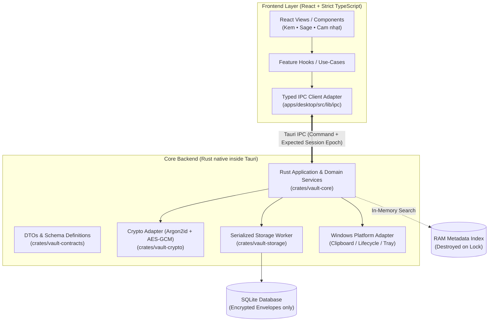

# 🗝️ Savantight — Két Cá Nhân

> **Zero-Knowledge, Offline-First Personal Secrets Vault for Windows**  
> *Kiến trúc bảo mật nghiêm ngặt xây dựng trên nền tảng Tauri 2 + Rust + React + TypeScript.*

---

[](https://tauri.app/)
[](https://www.rust-lang.org/)
[](https://react.dev/)
[](https://www.typescriptlang.org/)
[](https://tailwindcss.com/)
[](#)
[](LICENSE)

---

## 🌟 Giới Thiệu (Overview)

**Savantight** (tên gọi tiếng Việt: **Két cá nhân**) là ứng dụng desktop quản lý thông tin nhạy cảm (tài khoản, mật khẩu, API keys, biến môi trường `.env`) hoạt động hoàn toàn **offline** và **cục bộ** trên Windows.

Ứng dụng tuân thủ phương châm **"Bảo mật không thỏa hiệp" (Zero-Compromise Security)**:
* **Không máy chủ web trung gian:** Không dựng Spring Boot, Express, REST API localhost, JWT hay Redis. Backend là tiến trình Rust native siêu nhẹ tích hợp sâu trong Tauri 2.
* **Không lưu secret dưới dạng Plaintext:** Mọi dữ liệu (tên, label, URL, email, ghi chú, giá trị biến môi trường) đều được đóng gói trong các envelope mã hóa AES-256-GCM trước khi ghi vào SQLite.
* **Contract-First IPC:** Giao tiếp giữa WebView và Rust Core được ràng buộc kiểu dữ liệu tuyệt đối qua hệ thống Schema & Bindings tự động sinh từ Rust, ngăn chặn hoàn toàn sai lệch kiểu và stale response.

---

## 🛡️ Triết Lý Kiến Trúc & An Toàn Mật Mã



### 1. Phân Vùng Quyền Hạn Nghiêm Ngặt
* **Frontend là Unstrusted Boundary:** React **tuyệt đối không** gọi SQL trực tiếp, không tự sinh lệnh Tauri, không giữ Master Password, không giữ KEK (Key Encryption Key) hay DEK (Data Encryption Key).
* **Rust Core là Single Source of Truth:** Kiểm tra quyền hạn, session epoch, validate bounds và rate limit tại Rust trước khi thực hiện bất kỳ thao tác nhạy cảm nào.

### 2. Mô Hình Mật Mã (Cryptographic Standards)
* **KDF:** **Argon2id** dẫn xuất KEK từ Master Password và Salt CSPRNG (thông số bộ nhớ/thời gian được bảo toàn, không tự ý giảm để chạy benchmark).
* **Mã hóa Dữ liệu:** **AES-256-GCM** với AAD (Additional Authenticated Data) ràng buộc danh tính: `vault_id`, `record_id`, `revision`, `schema_version`.
* **Zero Disk Plaintext Search:** Không bật FTS/plaintext search index trên đĩa. Metadata tìm kiếm được giải mã vào RAM khi mở két và bị hủy tức thì khi khóa két.

### 3. Vòng Đời & Kiểm Soát Đồng Thời (Concurrency & Race Mitigation)
* **State Machine:** `NoVault` $\rightarrow$ `Creating` $\rightarrow$ `Locked` $\rightarrow$ `Unlocking` $\rightarrow$ `Unlocked` $\rightarrow$ `Locking` $\rightarrow$ `Unavailable`.
* **Session Epoch & Lock Barrier:** Khi khóa két (`vault_lock`), Rust tăng Session Epoch, hủy bỏ mọi tác vụ KDF đang chạy dở, xóa sạch bộ nhớ tạm. Mọi request bất đồng bộ đến từ epoch cũ đều bị Rust từ chối thẳng thừng (`STALE_SESSION`).
* **Atomic Clipboard Management:** Thao tác copy mật khẩu sử dụng token thế hệ và cơ chế compare-and-clear (mặc định xóa sau 20 giây), ngăn timer cũ vô tình xóa nội dung copy mới.

---

## 🎨 Trải Nghiệm Người Dùng (UX/UI Highlights)

* **Thiết kế tối giản, êm dịu:** Bảng màu chủ đạo gồm màu kem nhạt (nền ấm áp), xanh sage thanh lịch và điểm nhấn cam nhạt. Bo góc mềm mại (`rounded-xl`), biểu tượng lỗ khóa/két đặc trưng.
* **Không Dashboard thừa thãi:** Không hiển thị biểu đồ rườm rà, không điểm số bảo mật ảo, tập trung thẳng vào việc tìm và sao chép thông tin.
* **Phân cấp Nền tảng thông minh (Smart Grouping):**
  * **1 tài khoản:** Hiển thị trực tiếp.
  * **2–4 tài khoản:** Chuyển đổi nhanh qua thanh Selector tabs.
  * **Trên 4 tài khoản:** Danh sách cuộn tích hợp bộ lọc tìm kiếm nhanh.
* **Phân loại dữ liệu rõ ràng (Discriminators):**
  * 🔑 **Tài khoản / Mật khẩu:** Tách biệt summary và secret payload; thao tác hiện mật khẩu (reveal) được cô lập ngắn hạn.
  * ⚡ **API Keys / Tokens:** Hỗ trợ nhãn dự án, quyền hạn, ghi chú.
  * 🌐 **Environment Bundles (`.env`):** Phân tách rạch ròi theo môi trường (`dev` / `staging` / `prod`) và dự án, hỗ trợ parser chống xung đột key.
  * 📝 **Ghi chú bảo mật (Secure Notes):** Lưu trữ ghi chú nhạy cảm mã hóa.
* **Khu vực Cài đặt độc lập:** Tách riêng 5 phân hệ: *Bảo mật*, *Giao diện*, *Sao lưu*, *Riêng tư*, *Thông tin*.
* **Chế độ riêng tư (Privacy Mode):** Ẩn nhanh hoặc khóa tức thời giao diện qua phím tắt toàn cục.

---

## 📂 Cấu Trúc Mã Nguồn (Project Structure)

```text
Savantight/
├── apps/
│   └── desktop/                  # Ứng dụng Desktop Tauri 2
│       ├── src/                  # Mã nguồn React + TypeScript
│       │   ├── app/              # Router, Provider, Shell bố cục
│       │   ├── features/         # Các phân hệ: onboarding, unlock, vault, settings
│       │   ├── components/ui/    # Primitives UI dùng chung (Buttons, Inputs, Modals)
│       │   ├── lib/ipc/          # Điểm DUY NHẤT thực thi Tauri invoke/listen
│       │   └── styles/           # Tokens màu sắc, font chữ, CSS variables
│       └── src-tauri/            # Cấu hình Tauri 2 & capability policies
│
├── crates/                       # Rust Crates nội bộ (Core Engine)
│   ├── vault-core/               # Domain invariants, Use-cases & State Machine
│   ├── vault-contracts/          # Nguồn chuẩn DTOs, Enums, Command specs
│   ├── vault-crypto/             # Wrapper Argon2id, AES-256-GCM, CSPRNG
│   ├── vault-storage/            # SQLite worker, migrations, aggregate revisions
│   └── vault-platform/           # Windows Clipboard adapter, hotkeys, lifecycle
│
├── packages/
│   └── contracts/                # TypeScript bindings & schemas sinh tự động
│
├── docs/                         # Tài liệu đặc tả kỹ thuật
│   ├── architecture.md           # Thiết kế kiến trúc phân tầng
│   ├── security.md               # Mô hình đe dọa (Threat model) & Mật mã
│   ├── quality.md                # Tiêu chuẩn code, ngân sách hiệu năng & linting
│   ├── workflow.md               # Quy chuẩn điều phối đa agent
│   └── contracts/                # Đặc tả hợp đồng IPC & Changelog
│
├── scripts/                      # Script kiểm tra drift, test suites, codegen
├── MASTER_PROMPT.md              # Đặc tả cốt lõi khởi tạo dự án
└── README.md                     # Tài liệu tổng quan dự án
```

---

## 🤖 Quy Trình Điều Phối Đa Tác Nhân (Multi-Agent Protocol)

Dự án áp dụng quy trình phát triển và kiểm soát chất lượng dựa trên mô hình **4 vai trò độc lập** và nguyên tắc **Single-Writer**:

| Vai trò | Trách nhiệm chính | Ranh giới cấm vượt |
|---|---|---|
| **Codex Backend** | Rust core, domain, storage, crypto, IPC contract, integration steward | Không sửa UI frontend; không tự duyệt PR của mình |
| **Antigravity Frontend** | React/TS, UI components, states (empty/error/stale), typed IPC adapter | Không gọi SQL trực tiếp; không giữ master key; không tự tạo command |
| **Backend Reviewer** | Review độc lập bảo mật, crypto, concurrency, query plans, leaks | Không tự viết implementation rồi tự phê duyệt |
| **Frontend Reviewer** | Review độc lập UX, accessibility, rò rỉ secret, tuân thủ IPC contract | Không phê duyệt dựa trên screenshot mà không soi diff |

### Chu trình vòng đời Task:
$$\mathbf{TODO} \longrightarrow \mathbf{READY} \longrightarrow \mathbf{IN\_PROGRESS} \longrightarrow \mathbf{REVIEW\_PENDING} \longrightarrow \mathbf{APPROVED} \longrightarrow \mathbf{INTEGRATING} \longrightarrow \mathbf{DONE}$$

> **Quy tắc:** Mọi commit tích hợp đều phải trải qua kiểm thử độc lập, đối chiếu mã SHA và review có chữ ký trước khi merge vào nhánh chính.

---

## 🚀 Bắt Đầu Phát Triển (Getting Started)

### Yêu cầu tiên quyết:
* **Hệ điều hành:** Windows 10/11 (khuyến nghị cho môi trường native).
* **Rust Toolchain:** `rustc` và `cargo` $\ge$ 1.78 (Khuyến nghị 1.97+).
* **Node.js:** $\ge$ v20.x (Kiểm thử trên v25.x).
* **Tauri 2 CLI:** `cargo install tauri-cli --version "^2.0.0"`.

### Cài đặt & Chạy thử:

1. **Clone repository:**
   ```powershell
   git clone https://github.com/your-username/Savantight.git
   cd Savantight
   ```

2. **Cài đặt dependencies frontend:**
   ```powershell
   npm install
   ```

3. **Chạy ứng dụng trong chế độ Development (Tauri Desktop):**
   ```powershell
   npm run tauri dev
   ```

4. **Kiểm tra chất lượng mã nguồn & Typecheck:**
   ```powershell
   # Frontend lint & typecheck
   npm run lint
   npm run typecheck

   # Rust cargo test & clippy
   cargo test --workspace
   cargo clippy --workspace -- -D warnings
   ```

---

## 🗺️ Lộ Trình Phát Triển (Roadmap)

- [x] **Milestone 0: Đặc tả & Khởi tạo**
  - [x] Soạn thảo đặc tả kiến trúc (`MASTER_PROMPT.md`, `architecture.md`, `security.md`).
  - [x] Thiết lập workflow điều phối đa agent và hợp đồng mẫu IPC v0.1.
- [ ] **Milestone 1: Scaffold & Shell IPC (Task B-001 / F-001 / C-001)**
  - [ ] Khởi tạo workspace Cargo đa crate và cấu trúc `apps/desktop`.
  - [ ] App shell React (bảng màu kem/sage, điều hướng Cài đặt, empty/locked states).
  - [ ] Triển khai lệnh IPC không nhạy cảm đầu tiên: `vault_status`.
- [ ] **Milestone 2: Slice Mã Hóa Cốt Lõi (Core Encrypted Slice)**
  - [ ] Tạo vault giả lập $\rightarrow$ Khóa/Mở với Argon2id.
  - [ ] Lưu trữ Platform với nhiều tài khoản trong SQLite mã hóa.
  - [ ] Lệnh Copy mật khẩu Rust native kèm cơ chế xóa clipboard tự động (20s).
- [ ] **Milestone 3: Tính Năng Nâng Cao (Backlog v1)**
  - [ ] Bộ tạo mật khẩu CSPRNG và phát hiện mật khẩu trùng lặp trong bộ nhớ.
  - [ ] Tích hợp kiểm tra rò rỉ HIBP (Have I Been Pwned) qua k-Anonymity (chỉ kích hoạt khi người dùng cho phép).
  - [ ] Quản lý cấu hình biến môi trường (`.env`) theo Project & Environment.
  - [ ] Sao lưu & phục hồi dữ liệu mã hóa (Encrypted Snapshot Backup).

---

## ⚠️ Tuyên Bố Minh Bạch (Honest Disclosure)

* Dự án hiện đang trong giai đoạn xây dựng khung (scaffold) và kiểm chứng luồng dữ liệu ban đầu.
* **Chưa sử dụng để lưu trữ dữ liệu thật** cho đến khi toàn bộ các bài kiểm thử bảo mật (wrong password, tamper test, concurrency race, stale epoch) được Backend & Frontend Reviewer độc lập phê duyệt.
* Không có phần mềm nào có thể bảo vệ an toàn nếu máy trạm của người dùng đã bị mã độc/rootkit hoặc tài khoản Administrator chiếm quyền điều khiển.

---

<div align="center">
  <sub>Được phát triển với niềm đam mê bảo mật và kỹ thuật phần mềm chuẩn chỉ.</sub>
</div>
