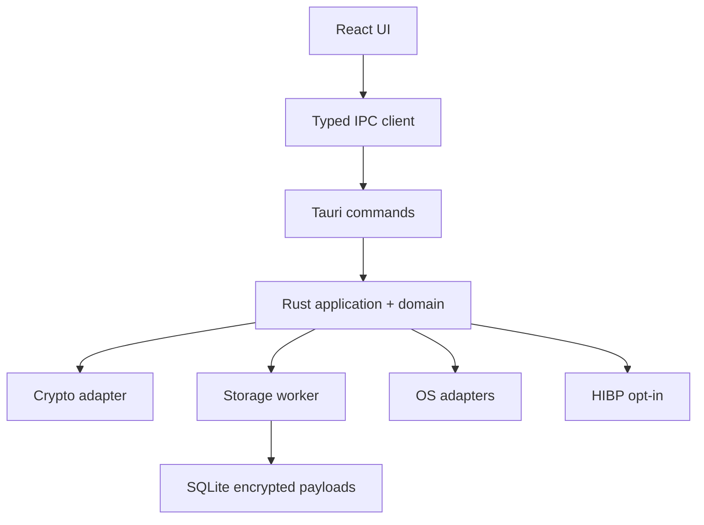
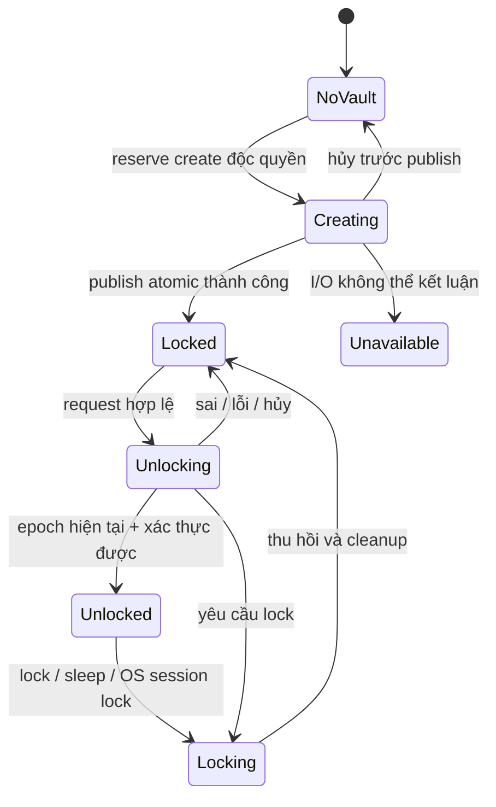

# Kiến trúc nền — đề xuất triển khai

Trạng thái: baseline thiết kế; contract cụ thể cần ACK trước implementation. Chưa có application source được triển khai trong gói này.

## Biên tin cậy



Frontend được coi là không đủ tin cậy để cấp quyền. Mọi command bí mật phải kiểm tra state, record scope và policy ở Rust. Không server HTTP localhost; IPC là giao diện nội bộ có schema và quyền caller rõ ràng.

## Layout khi bắt đầu tạo source

```text
apps/desktop/
  src/
    app/                    # providers/router/shell; không domain rules
    features/
      onboarding/
      unlock/
      vault/                # platform list/account selector/details
      settings/
    components/ui/          # primitives thực sự được dùng chung
    lib/ipc/                # entry duy nhất của invoke/listen
    styles/                 # design tokens, base, reduced motion
  src-tauri/                # bootstrap/commands/capabilities/config
crates/
  vault-core/src/
    domain/                 # entity, invariants, errors
    application/            # use-cases, session state machine
    ports/                  # traits cho crypto/storage/OS
  vault-contracts/src/      # DTO chuẩn; không secret Debug mặc định
  vault-crypto/src/         # wrappers/format/secret buffers
  vault-storage/src/        # connection worker/repositories/migrations
  vault-platform/src/       # clipboard, lifecycle, file dialog, HTTP
packages/contracts/         # generated TypeScript/schema + manifest
docs/                       # architecture/security/contracts/ADRs
scripts/                    # scripts kiểm tra thực sự được triển khai
```

Layout là định hướng, không lệnh tạo mỗi thư mục với file rỗng. Dùng workspace Cargo + một package frontend trước; không thêm công cụ monorepo nặng nếu không có nhu cầu.

## Mô hình dữ liệu

| Entity | Vai trò | Dữ liệu nhạy cảm trong envelope |
|---|---|---|
| VaultHeader | Format/KDF/salt/key-slot đã mã hóa | Wrapped DEK; không plaintext master password |
| Platform | Nhóm dịch vụ user-correctable | Tên, URL/domain, ghi chú |
| Credential | Một tài khoản/API key | Label, username, notes; secret payload tách summary |
| Project/Environment | Phạm vi cấu hình | Tên project/environment và labels |
| EnvBundle/EnvEntry | Bộ KEY=VALUE | Tên biến và giá trị, không lưu plaintext index |
| Settings | Policy từng vault và UI prefs | Setting nhạy cảm mã hóa; setting cần khi locked xử lý riêng |

UUID/ID ngẫu nhiên là identity. Không dùng email/domain/label làm ID. Một username có thể xuất hiện ở nhiều record; không tự merge/delete tài khoản vì trùng username hoặc password. Số tài khoản nền tảng chỉ tính credential gắn platform đó, theo filter được quy định.

Summary envelope được giải mã để liệt kê/tìm kiếm; secret envelope chỉ giải mã khi cần copy/reveal/edit/scan hoặc re-encrypt authenticated context. Baseline dùng **một aggregate revision**: mỗi mutation của entity mã hóa lại cả summary và secret envelope hiện có bằng nonce mới rồi commit revision + envelopes cùng transaction. Metadata-only update giữ nguyên giá trị secret nhưng re-encrypt nó nội bộ; không gửi secret lên UI. Update phải phân biệt leave/set/clear theo field policy. Không dùng masked string như secret giả trong form submit.

Encrypted SQLite payloads không che được số record, quan hệ, loại, revision, kích thước hoặc header công khai. Không gọi đây là full-database encryption. Nếu thay bằng SQLCipher/Stronghold/format khác, phải ADR với migration, threat model và review; không chồng hai hệ mật mã không có mục đích.

## Storage và search

- SQL nằm một adapter; parameterized queries. Một worker có bounded queue; transaction ngắn, không giữ transaction trong lúc đợi UI/network/KDF.
- Bật foreign keys trên mọi connection. Unique composite/foreign key theo vault scope; revision CAS kiểm tra affected rows.
- Index dự kiến cho credential `(vault_id, platform_id, id)` và quan hệ project/env theo query; xác minh migration/EXPLAIN trước gọi là tối ưu. Không tạo index cho tất cả cột hoặc ciphertext vô ích.
- List platform + counts dùng fixed queries/aggregation; account page query dùng cursor ổn định và max page size. Không select secret column khi chỉ cần summary.
- Search trên metadata index trong RAM Rust; không password values. Thực hiện batch warm-up ngoài UI và hiển thị trạng thái nếu chưa sẵn sàng. Tiếng Việt tìm không dấu có thể được chuẩn hóa riêng cho metadata; không áp normalization lên secret.
- Cache có giới hạn và gắn epoch/revision. Lock xóa index/session cache. Tối ưu sau số liệu, không dùng cache plaintext persistent để đạt budget.

## State và đồng thời



Lock barrier phải tuyến tính hóa với reveal/copy/commit: command cũ không được chạy side effect sau barrier. Không chỉ kiểm tra bool một lần đầu hàm. Copy service/session generation và storage transaction coordination phải có thứ tự lock nhất quán, tránh deadlock. Khi epoch thay đổi, chỉ được trả metadata tối thiểu báo locked; không secret của phiên cũ.

Request phiên mở luôn có expectedSessionEpoch, checked cả khi admission và tại side-effect boundary; response gắn requestId/epoch. Một command bị queue ở phiên A không được được cấp quyền của phiên B sau lock/reunlock. Epoch không phải credential, Rust vẫn kiểm tra current state/policy.

NoVault chỉ áp dụng khi xác nhận không có vault. File hiện hữu nhưng corrupt/unreadable là Unavailable/error, không mời tạo đè. Create dùng reservation trước KDF, generation và atomic no-clobber publication. Nếu lock xảy ra trước publication, revoke generation, bỏ output và cleanup temp; state NoVault. Nếu publication hoàn tất trước lock, state Locked. Lock NoVault là no-op giữ NoVault. Create/unlock requests mang expectedLifecycleEpoch để chống stale tasks trước session mở.

## Tách sản phẩm khỏi demo

Preview chạy browser có thể dùng fixture data giả; production build không được import mock success adapter. Backend chưa implement trả NOT_IMPLEMENTED, không tạo file plaintext rồi ghi “encrypted”. First scaffold có thể chỉ `vault_status`; slice tiếp theo phải dùng encryption thật với dữ liệu giả.

Các luồng đặc biệt backup, restore, master change, recovery và OS integration có ADR/tests riêng. Không gọi ready-for-real-secrets chỉ vì UI đã đẹp hoặc app mở được.
